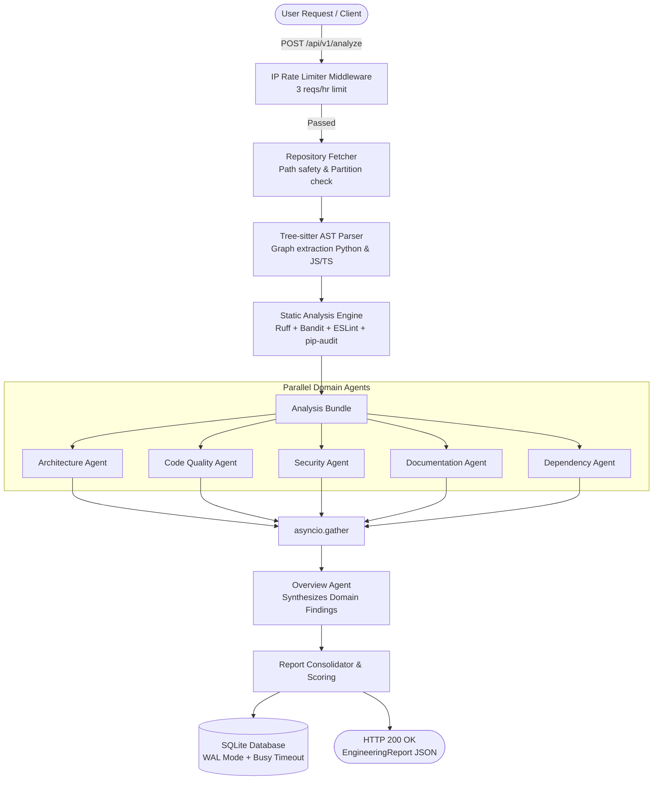

# CodePulse — Multi-Agent Codebase Intelligence Engine

[](https://fastapi.tiangolo.com)
[](https://python.org)
[](https://tree-sitter.github.io/tree-sitter/)
[](https://ai.google.dev)
[](LICENSE)

**CodePulse** is an automated multi-agent code analysis platform designed to audit repository quality, security vulnerabilities, module architecture, docstring coverage, and third-party dependencies in sub-15 seconds.

It combines multi-language AST graph extraction via **Tree-sitter** and **NetworkX**, multi-linter static diagnostics (**Ruff**, **Bandit**, **ESLint**, **pip-audit**), and 6 asynchronous LLM agents executing in parallel with strict grounding constraints.

---

## Key System Architecture & Flow



---

## 6-Agent Subsystem Architecture

CodePulse implements Strategy C prompt engineering with verbatim grounding rules to eliminate hallucinations:

1. **Architecture Agent (`architecture-v1`)**: Analyzes directory clustering, import edges, module coupling, and circular dependency cycles.
2. **Code Quality Agent (`code-quality-v1`)**: Audits linting diagnostics, maintainability, and code style rules from Ruff & ESLint.
3. **Security Agent (`security-v1`)**: Inspects AST security warnings, hardcoded credentials, and Bandit vulnerability vectors.
4. **Documentation Agent (`documentation-v1`)**: Evaluates README completeness, line counts, and docstring coverage across modules.
5. **Dependency Agent (`dependency-v1`)**: Checks third-party package manifests (`requirements.txt`, `package.json`) and audit logs.
6. **Overview Agent (`overview-v1`)**: Executes sequentially after domain agents finish to compile a grounded executive summary.

---

## Quickstart & Local Setup

### Prerequisites
- **Python 3.13+**
- **Node.js 20+** (optional, required for JS/TS ESLint runs)
- **Git**

### 1. Clone Repository & Setup Environment
```bash
git clone https://github.com/zaryabmustafa199/CodePulse.git
cd CodePulse

# Create virtual environment
python -m venv .venv
# Activate on Windows
.\.venv\Scripts\activate
# Activate on Linux/macOS
source .venv/bin/activate

# Install dependencies
pip install -r requirements.txt
```

### 2. Configure Environment Variables
Copy `.env.example` to `.env` and paste your Google Gemini API key:
```bash
cp .env.example .env
```
Edit `.env`:
```env
GEMINI_API_KEY=your_gemini_api_key_here
```

### 3. Run FastAPI Application
```bash
python -m uvicorn src.backend.main:app --host 127.0.0.1 --port 8000 --reload
```
Navigate to `http://127.0.0.1:8000/docs` to interact with Swagger API documentation.

---

## Docker Container Deployment

CodePulse provides a production-grade dual-runtime Docker container containing both Python and Node.js toolchains:

```bash
# Build Docker image
docker build -t codepulse:latest .

# Run container with docker-compose
docker-compose up -d
```

The containerized API will be accessible at `http://localhost:8000`.

---

## API Endpoints Specification

### 1. Analyze Repository
`POST /api/v1/analyze`

**Request Payload:**
```json
{
  "repository_path": "D:\\Projects\\PORTFOLIO\\CodePulse"
}
```

**Response Payload (`EngineeringReport`):**
```json
{
  "status": "success",
  "total_latency_seconds": 1.24,
  "overall_score": 9,
  "overall_grade": "A",
  "executive_summary": "Analysis of repository 'CodePulse': 20 files scanned with primary language Python.",
  "repository_path": "D:\\Projects\\PORTFOLIO\\CodePulse",
  "primary_language": "python",
  "total_files": 20,
  "total_lines": 1950,
  "domain_findings": {
    "overview": { ... },
    "architecture": { ... },
    "code_quality": { ... },
    "security": { ... },
    "documentation": { ... },
    "dependency": { ... }
  }
}
```


### 2. Retrieve Past Analysis Report
`GET /api/v1/analysis/{analysis_id}`

Retrieves historical analysis records directly from SQLite database persistence.

---

## License

Distributed under the MIT License. See `LICENSE` for more information.
